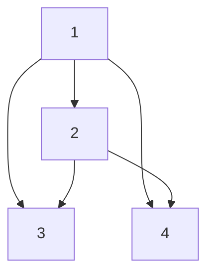

## 3.1.2 图的储存和搜索

*2025年5月17日*

### 图的储存


在 C++ 中，图的存储方式主要有两种：**邻接表（Adjacency List）** 和 **邻接矩阵（Adjacency Matrix）**。选择哪种方式取决于图的类型（有向图 / 无向图）、密度（稀疏图 / 稠密图）以及具体的算法需求。以下是**邻接表**的详细介绍和代码示例：

```c++
const int N = 1e5 + 10;
int ne[N], e[N], idx, h[N];
void add(int a, int b) {
	e[++idx] = b, ne[idx] = h[a], h[a] = idx;
}
```

例：

```c++
add(1, 2);
add(1, 3);
add(2, 3);
add(2, 4);
add(1, 4);
```

在内存中的储存为：

```c++
h[1]:  1 -> 4 -> 3 -> 2
h[2]:  2 -> 4 -> 3    
```

内存中储存为**两条链表**， 实际为：



### 搜索

#### 用BFS搜索：

*此题为变式题， 模板题在下方*

##### 题目描述

给定一个 n 个点 m 条边的有向图，图中可能存在重边和自环。

所有边的长度都为 1 ，点的编号为 $(1 \sim n) $。

请你求出 3 号点到 \(n - 1\) 号点的最短距离，如果从 3 号点无法走到 \(n - 1\) 号点，输出 \(-1\) 。

##### 输入格式

第一行包含两个整数 n 和 m 。

接下来 m 行，每行包含两个整数 a 和 b ，表示存在一条从 a 走到 b 的长度为 1 的边。

##### 输出格式

输出一个整数，表示 3 号点到 \(n - 1\) 号点的最短距离。

##### 数据范围

$(1 \leq n, m \leq 10^5)$

##### 输入样例

```plaintext
5 6
1 2
2 3
3 4
1 3
1 4
4 5
```

##### 输出样例

```plaintext
2
```

##### 代码

```c++
#include <iostream>
#include <cstring>

using namespace std;

const int N = 1e5 + 10;
int n, m;
int idx, e[N], ne[N], h[N], d[N];
int q[N];

void add(int a, int b) {
	e[++idx] = b, ne[idx] = h[a], h[a] = idx;
}
void bfs() {
	int tt = 0, hh = 0;
	memset(d, -1, sizeof d);
	d[3] = 0;
	q[0] = 3;
	while (hh <= tt) {
		int t = q[hh++];
		for (int i = h[t]; i != -1; i = ne[i]) {
			int j = e[i];
			if (d[j] == -1) {
				d[j] = d[i] + 1;
				q[++tt] = j;
			}
		}
	}
}
int main() {
	cin >> n >> m;
	memset(h, -1, sizeof h);
	while (m--) {
		int a, b;
		cin >> a >> b;
		add(a, b);
	}
	bfs();
	cout << d[n - 1] << endl;
	return 0;
}
```

##### 题目描述

给定一个 n 个点 m 条边的有向图，图中可能存在重边和自环。

所有边的长度都为 1 ，点的编号为 $(1 \sim n) $。

请你求出  1号点到 n 号点的最短距离，如果从 1 号点无法走到 n 号点，输出 \(-1\) 。

##### 输入格式

第一行包含两个整数 n 和 m 。

接下来 m 行，每行包含两个整数 a 和 b ，表示存在一条从 a 走到 b 的长度为 1 的边。

##### 输出格式

输出一个整数，表示 1 号点到 n  号点的最短距离。

##### 数据范围

$(1 \leq n, m \leq 10^5)$

##### 输入样例

```plaintext
4 5
1 2
2 3
3 4
1 3
1 4
```

##### 输出样例

```plaintext
1
```

##### 代码

```c++
#include <iostream>
#include <cstring>

using namespace std;

const int N = 1e5 + 10;
int idx, e[N], ne[N], h[N];
int q[N], d[N];
int n, m;

void add(int a, int b) {
	e[++idx] = b, ne[idx] = h[a], h[a] = idx;
}

int bfs() {
	int tt = 0, hh = 0;
	q[0] = 1;
	memset(d, -1, sizeof d);
	d[1] = 0;
	while (hh <= tt) {
		int t = q[hh++];
		for (int i = h[t]; i != -1; i = ne[i]) {
			int j = e[i];
			if (d[j] == -1) {
				d[j] = d[t] + 1;
				q[++tt] = j;
			}
		}
	}
	return d[n];
}
int main() {
	cin >> n >> m;
	memset(h, -1, sizeof h);
	while (m--) {
		int a, b;
		cin >> a >> b;
		add(a, b);
	}
	cout << bfs() << endl;
	return 0;
}
```

#### 用DFS搜索（难）

##### 题目描述

给定一棵树，树中包含 n 个结点（编号 $(1 \sim n) $）和 \(n - 1\) 条无向边。

请你找到树的重心，并输出将重心删除后，剩余各个连通块中点数的最大值。

重心定义：重心是指树中的一个结点，如果将这个点删除后，剩余各个连通块中点数的最大值最小，那么这个节点被称为树的重心。

##### 输入格式

第一行包含整数 n，表示树的结点数。

接下来 \(n - 1\) 行，每行包含两个整数 a 和 b，表示点 a 和点 b 之间存在一条边。

##### 输出格式

输出一个整数 m，表示重心的所有的子树中最大的子树的结点数目。

##### 数据范围

$(1 \leq n \leq 10^5)$

##### 输入样例

```plaintext
9
1 2
1 7
1 4
2 8
2 5
4 3
3 9
4 6
```

##### 输出样例

```plaintext
4
```

##### 代码

```c++
#include <iostream>
#include <cstring>

using namespace std;

const int N = 1e5 + 10;
int idx, e[N], ne[N], h[N];
int n, ans = N;
bool st[N];

void add(int a, int b) {
	e[++idx] = b, ne[idx] = h[a], h[a] = idx;
}

int dfs(int u) {
	st[u] = true;
	int num = 1, res = 0;
	for (int i = h[u]; i != -1; i = ne[i]) {
		int j = e[i];
		if (!st[j]) {
			int s = dfs(j); // 求其中一个子节点的值
			res = max(res, s); // 求子节点的最大值， 为下面和除u的数最大值比较做准备
			num += s; // 求算上自身的节点数， 便于回溯， 以及求除u的数最大值
		}
	} 
	res = max(res, n - num); // 求删除重心后，连通块的最大值
	ans = min(ans, res); // 连通块的最大值的最小值
	return num; // 回溯出 节点值
}
int main() {
	cin >> n;
	memset(h, -1, sizeof h);
	for (int i = 0; i < n - 1; i ++) {
		int a, b;
		cin >> a >> b;
		add(a, b), add(b, a);
	}
	dfs(1);
	cout << ans;
	return 0;
}
```

